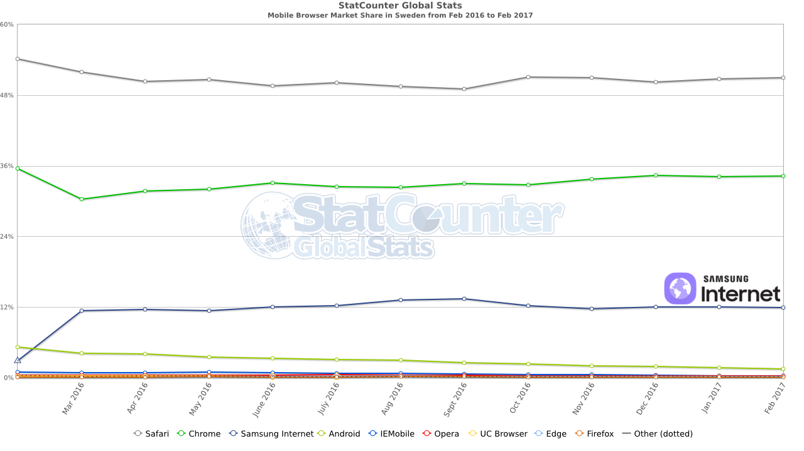

# {{page.title}}

<!-- Link to trigger conversion script -->
[Convert to Slide Deck](#aslides)

I am Ada Rose from Samsung Internet Developer Relations I am here to talk to you about Web Apps. Can I have a quick show of hands:

I am here today to talk about web apps

Web Apps are websites which are so good your users will want to save them to their home screen.

They can be installed like apps.

Chrome will even produce an APK

Browsers will notify the users that they can be installed.

* Who here is a web developer?
* Who here develops native apps?

I am aiming this talk at everyone as good web app requires thoughts from both.

<!-- This slide uses information from _config.yml -->
<blockquote style="background-image: url(&quot;images/lighthouse.jpg&quot;); display: block;">
<h1 id="building-web-apps-1">Building Web Apps</h1>

<h3 id="what-the-web-can-bring-to-apps">What the web can bring to Apps</h3>
<h2 id="ada-rose-edwards---samsung-research-uk">Ada Rose Edwards - Samsung Research UK</h2>
<h2 id="ladyadaking-samsunginternet">@lady_ada_king, @samsunginternet</h2>
<span class="slide-view-button"> View Slide</span></blockquote>

<blockquote style="background-color: white;">

</blockquote>

<!-- This slide uses information from _config.yml -->
<script>window._setNextSlide(window.playVideo);</script>
<blockquote class="dark">
<h1>A quick example of a web app:</h1>
<p>
<video src="images/add-to-homescreen.mp4" autoplay="true" muted></video>
</p>
</blockquote>


> # Increases Engagement
>
> 

<!-- This slide uses information from _config.yml -->
> <blockquote style="position: absolute; background: linear-gradient(to bottom, rgba(47,79,79,1) 10%, rgba(47,79,79,0.5) 100%); padding-bottom: 2em; text-shadow: 0 0 0.3em darkslategrey;">
> <p>(Left) Poster showing how to download an events app; and (right) how it could have looked if they used a website instead.</p>
> <p>– Peter Gasston‏ (@stopsatgreen)</p>
> </blockquote>
>
> 


> <div style="display: flex; flex-direction: row; align-items; auto;">
> <div style="text-align: left;">
> <h1>Cool Web Features</h1>
> <ul style="list-style-type: none;">
> <li>Instant Engagement</li>
> <li>World Wide</li>
> <li>Safe for users</li>
> <li>Instant Deploy</li>
> <li>Access via URLs</li>
> <li>Accessibility</li>
> </ul>
> </div>
> <div style="text-align: right;">
> <h1>Cool App Features</h1>
> <ul style="list-style-type: none;">
> <li>Works Offline</li>
> <li>Push Notifications</li>
> <li>Background Sync</li>
> <li>Icon on the Homescreen</li>
> <li>No URL Bar</li>
> <li>Not constrained to browser</li>
> <li></li>
> </ul>
> </div>
> </div>


> 

<script>_setNextSlide(elByEl());</script>
> <div>
> <h1>How do you define an App?</h1>
> <h1 style="text-align: right;">It's in an App Store.</h1>
> </div>
> <div>
> <h1>How do you define a Web Site?</h1>
> <h1 style="text-align: right;">It's in the browser.</h1>
> </div>
> <div>
> <h1>How do you define a Web App?</h1>
> <h1 style="text-align: right;">Uhhh.....</h1>
> </div>


<blockquote style="background: linear-gradient(to bottom, rgb(29, 23, 66) 0%, rgb(30, 30, 119) 40%, rgb(62, 43, 47) 100%);">

<h2 style="text-align: center;">Google Lighthouse</h2>
</blockquote>


<script>_setNextSlide({
	setup: function () {
		this.img = this.img || this.querySelector('img');
		this.img.style.transform = 'scale(2)';
		this.img.style.transformOrigin = '0 0';
	},
	action: function *() {
		yield;
		this.img.style.transition = 'transform 5s ease-in'
		this.img.style.transform = 'translateY(-100%) translateY(100vh) translateY(-3em)';
		yield;
	},
	teardown : function () {
		if (this.img) {
			this.img.style.transition = 'none';
		}
	}
});</script>
<blockquote style="background: white !important;">

</blockquote>

<script>_cssNextEl({
	'font-size': '2.5em'
});</script>
> * Responsively Designed
> * Web App Manifest
> * Triggers Browser Install Prompts
> * Going Offline
> * Push Notifications
> * Progressive Enhancement

<blockquote style="background-color: #141414 !important; padding: 0;">
<div class="support-icon-container" chrome samsung firefox edge safari></div>

</blockquote>

<script>window.setDynamicSlide(window.elByEl());</script>
<blockquote class="dark" style="background-image: url('images/bird9.jpg');">
<div class="support-icon-container" chrome samsung firefox-wip edge-wip></div>
<h1>Web App Manifest</h1>
<div class="highlighter-rouge"><pre class="highlight"><code><span class="nt">&lt;meta</span> <span class="na">name=</span><span class="s">"theme-color"</span> <span class="na">content=</span><span class="s">"#4E3F30"</span><span class="nt">&gt;</span>
<span class="nt">&lt;link</span> <span class="na">rel=</span><span class="s">"manifest"</span> <span class="na">href=</span><span class="s">"/static/manifest.json"</span><span class="nt">&gt;</span>
<span class="nt">&lt;link</span> <span class="na">href=</span><span class="s">"https://podle.ada.is/static/icon192.png"</span> <span class="na">rel=</span><span class="s">"icon"</span> <span class="na">sizes=</span><span class="s">"192x192"</span> <span class="nt">/&gt;</span>
</code></pre>
</div>
<div class="highlighter-rouge"><pre class="highlight"><code><span class="p">{</span><span class="w">
</span><span class="nt">"name"</span><span class="p">:</span><span class="w"> </span><span class="s2">"Podle"</span><span class="p">,</span><span class="w">
</span><span class="nt">"icons"</span><span class="p">:</span><span class="w"> </span><span class="p">[</span><span class="w">
	</span><span class="p">{</span><span class="w">
		</span><span class="nt">"src"</span><span class="p">:</span><span class="w"> </span><span class="s2">"/static/icon192.png"</span><span class="p">,</span><span class="w">
		</span><span class="nt">"sizes"</span><span class="p">:</span><span class="w"> </span><span class="s2">"192x192"</span><span class="p">,</span><span class="w">
		</span><span class="nt">"type"</span><span class="p">:</span><span class="w"> </span><span class="s2">"image/png"</span><span class="w">
	</span><span class="p">},</span><span class="w">
	</span><span class="p">{</span><span class="w">
		</span><span class="nt">"src"</span><span class="p">:</span><span class="w"> </span><span class="s2">"/static/icon512.png"</span><span class="p">,</span><span class="w">
		</span><span class="nt">"sizes"</span><span class="p">:</span><span class="w"> </span><span class="s2">"512x512"</span><span class="p">,</span><span class="w">
		</span><span class="nt">"type"</span><span class="p">:</span><span class="w"> </span><span class="s2">"image/png"</span><span class="w">
	</span><span class="p">}</span><span class="w">
</span><span class="p">],</span><span class="w">
	</span><span class="nt">"start_url"</span><span class="p">:</span><span class="w"> </span><span class="s2">"/v7/"</span><span class="p">,</span><span class="w">
	</span><span class="nt">"display"</span><span class="p">:</span><span class="w"> </span><span class="s2">"standalone"</span><span class="p">,</span><span class="w">
	</span><span class="nt">"background_color"</span><span class="p">:</span><span class="w"> </span><span class="s2">"white"</span><span class="p">,</span><span class="w">
	</span><span class="nt">"theme_color"</span><span class="p">:</span><span class="w"> </span><span class="s2">"#4E3F30"</span><span class="w">
</span><span class="p">}</span><span class="w">
</span></code></pre>
</div>
</blockquote>

<blockquote>
<div class="support-icon-container" samsung style="padding-top: 1.5em;"><h3 style="margin: 0;position: absolute;top: 0;">Ambient Badging</h3></div>
<div class="support-icon-container" samsung chrome style="padding-top: 1.5em;"><h3 style="margin: 0;position: absolute;top: 0;">Installation Prompt</h3></div>
<h1>Triggering Browser Install Prompts</h1>

<h2>https://samsunginter.net/docs/ambient-badging.html</h2>
</blockquote>

<script>_setNextSlide(elByEl('.support-icon-container'));</script>
<blockquote>
<div class="support-icon-container" chrome samsung firefox edge-wip></div>


</blockquote>

<script>_setNextSlide(elByEl('h1'));</script>
> # Registering a Serivce Worker
>
> ```javascript
 if ('serviceWorker' in navigator) {
>
 		if (navigator.serviceWorker.controller) {
>
			// service worker already registered.
 			return navigator.serviceWorker.ready;
 		} else {
>
			// service worker not registered
 			return navigator.serviceWorker.register('/sw.js', {scope: './'})
 			.then(() => navigator.serviceWorker.ready);
 		}
 	}
```
>
> ## The browser will start your Service Worker when a request is made in your service worker's scope
>
> ## The browser may stop your worker at any point if it is not being used.
>
> ## The service worker can intercept any fetch request made by the browser.

<script>_setNextSlide(elByEl('h1'));</script>
> # Intercepting Network requests
>
> ```javascript
self.addEventListener('fetch', function(event) {
	const request = event.request;
>
	// Let videos go straight to the network
	if (request.url.match(/(\.mp4|\.webm|\.avi|\.wmv|\.m4v)$/i)) {
		return;
	}
>
	// Generate Response here
	if (request.url.match(/^https:\/\/ada.is\/static\//i)) {

		// doSomething, returns promise which resolves to a Response
		const response = doSomething(request);
		return event.respondWith(response);
	}
});
```
>
> * cache responses for speed
> * cache responses to work offline
> * create new responses
> * precache static resources on app start

> # Push Notifications
> <div class="support-icon-container" chrome samsung firefox edge-wip></div>
>
> 

> # 3 steps to Push Notifications:
>
> 1. Request permission
> 2. Get endpoint & token, save to server
> 3. On the server make an API call on the endpoint with your notification

<script>_setNextSlide(elByEl('h1'));</script>
> # Get permission
>
> > NB in Chrome and Samsung Internet you need to register on *firebase cloud messaging* and add your project's id to your web app manifest.
> >
> > `gcm_sender_id": "103953800507"`
>
> ```javascript
// Has to occur with user input
myButton.addEventListener('click', function () {
>
	navigator.serviceWorker.ready.then(function () {
>
		reg.pushManager.subscribe({
			userVisibleOnly: true // declare we will use push for notifications
		}).then(function success(subscription) {
>
			// Tell user we are good to go
			storeSubscription(subscription); // see next slide
		}, function error() {
>
			// User may have declined or the browser or OS may have refused
		});
	});
});
```

> # Save token to server
>
 > ```json
 {
  "endpoint": "http://example.com/some/uuid"
 }
```
>
> <p style="display: block;">In this case the url looks something like:
> <span style="word-break: break-all; font-family: monospace; font-size: 0.8em;">https://android.googleapis.com/gcm/send/cz6YgbRXHAc:APA91bGWtm35_kAQsZEn_Ye…EVXj1MDXGulbtBWJYw4AGcIWXq7p5BjhFhnDhMQoqOHRzY9jI_OeOn_DQ5W_cYD5tCDDdjOD7d</span></p>
>
> ```javascript
function storeSubscription(subscription) {
	return fetch('/api/send-message', {
		method: 'POST',
		credentials: 'same-origin',
		headers: new Headers({
			'Content-Type': 'application/json',
			'Accept': 'application/json'
		}),
		body: JSON.stringify(subscription)
	})
}
```

> # Using that token on the server:
>
> ## Ideally make a post request to the endpoint.
>
> ## **BUT** differing implementations make this a little awkward so I use:
>
> ## *https://github.com/web-push-libs/web-push*


## Good Push Notifications

The overarching theme here is: Inform the user, show them they have control.

When to ask for permission, give context clues. Don't expect the user to trust you.

Say what you are going to use them for and make it clear where they can reduce their notifications.


Push notifications need to be timely. Don't alert for something that does not need immediate attention.

Allow the user to not open your app.

A "yes or no" answer can be done in the notification itself!


<blockquote style="justify-content: flex-end;padding: 0;min-height: 600px;">
<!--<h1 style="color: black;position: absolute;top:  0;z-index: 5;padding: 0.5em;box-sizing: border-box;text-shadow: none;font-size: 1.5em;text-shadow: 0 0 1em grey;">The hard part of notifications is choosing when not to send them...</h1>-->

<h2 style="align-self: flex-end;background: linear-gradient(to top, rgba(47,79,79,1) 10%, rgba(47,79,79,0.5) 100%);text-shadow: 0 0 0.3em darkslategrey;z-index: 2;padding: 1em;box-sizing: border-box;margin: 0;font-size: 1.2em;">https://slack.engineering/reducing-slacks-memory-footprint-4480fec7e8eb#.br9mtzz2r</h2>
</blockquote>

> # Progressive Enhancement
>
> ## Browser vendors have different priorities.

> # Future Web APIs coming soon to a browser near you
>
> ## Web Payment
>
> ## Web Assembly
>
> ## WebGL2

Some fun patterns it may be worth looking into:

> # Web App Patterns (Secret slide)
>
> ## PRPL
>
> ## Web App Shell Model
>
> ## Headless Web
<!--

If you have concerns about whether the Web has the features you need the web platform has:

* Offline support
* Push Notifications
* Background Sync
* Web Payment
* WebGL
* P2P Messaging
* A myriad of other APIs for working with audio streams

Future APIs

* Web Bluetooth
* Web USB


Unfortunately the future is not evenly distribted

* Chrome, Firefox and Samsung Internet have great support for the core features that go into a Progressive Web App
* Safari hasn't been focusing on Web Apps in recent years but have implememnted Promises and Fetch the first steps needed for Service Workers

Safari can run offline using an old browser feature called App Cache but it has a frustrating API and not recommended.

If you require push notifications on iOS Safari then you will need to use a wrapper like Cordova and ship a native app.

> Does the web have the features I need?
> Is serviceworker ready yet?

If you are going down the route of getting a web site on a user's homescreen what do you need to do?

Nothing, any website can be added to the homescreen manually

Icons can be defined in the head and this will work everywhere

But we want that sweet prompt and the ambient badging

You need:

> * https (http2 for better speed)
> * service Workers
> * web app manifest
>
> Google's Lighthouse will test your app for how well it behaves like an app to rate it out of hundred to help you find anythign you missed

* Describe what a service worker is

* Describe how to set it up

# Useful Patterns

These are just tools, you don't have to stick to them rigidly.

If you are already producing apps in a way that works for you and your customers stick with it.

The Goals of these patterns are to get users engaged early, keep them engaged during that first session and to keep them coming back

# PRPL

Pattern for routing and precaching.

The goal is to have a fast first load to avoid users on slow conneections giving up.

Then have future loads happen almost instantaenously and have some even work when there is no connection.

<ol style="font-size: 1.5em;" class="prpl">
<li>Push critical resources for the initial route.</li>
<li>Render initial route.</li>
<li>Pre-cache remaining routes.</li>
<li>Lazy-load and create remaining routes on demand.</li>
</ol>

# Web App Shell Model

Shares many similarities with PRPL

With a focus on seperating the app from the content.

So that when the network fails the whole app works even if some of the content cannot be fetched.

Pattern for content caching and what to prioritise.

Send down pre-rendered first load,

Long cache resources for the Application Shell

If following the PRPL pattern then you can start precaching some future content.

# Headless Web

To me this is one of the more revolutionary patterns.

You perform most of your user interactions via push notifications.

Minimising drain on users attention, be useful and timely but not intrusive.

Become an invaluable part of their phone experience and they will keep coming back.
-->

<script>

	// Add links to deep link into slides
	var blockquote = Array.from(document.querySelectorAll('body > blockquote'));
	var newSpans = [];
	document.querySelector('a[href="#aslides"]').addEventListener('click', function () {
		newSpans.forEach(function (s) {
			s.removeEventListener('click', onclick);
			s.remove();
		});
		newSpans.splice(0);
	});
	blockquote.forEach(function (el) {
		var span = document.createElement('span');
		newSpans.push(span);
		span.textContent = ' View Slide';
		span.addEventListener('click', function onclick() {
			window.removeHashChangeEventListener();
			newSpans.forEach(function (s) {
				s.removeEventListener('click', onclick);
				s.remove();
			});
			init().then(function () {
				document.querySelector('.a-slides_slide-container').dispatchEvent(new CustomEvent('a-slides_goto-slide', {detail: {slide: el.parentNode}}));
			});
		});
		span.setAttribute('class', 'slide-view-button');
		el.appendChild(span);
	});
</script>