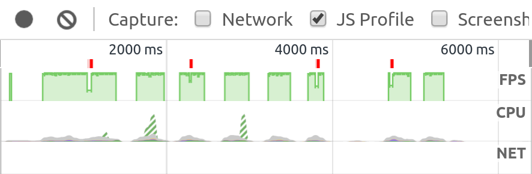
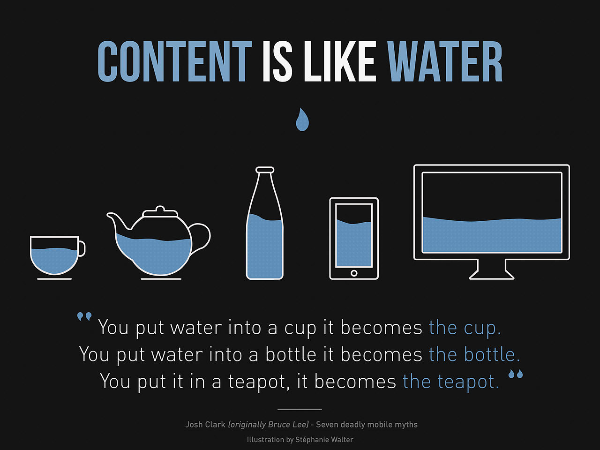
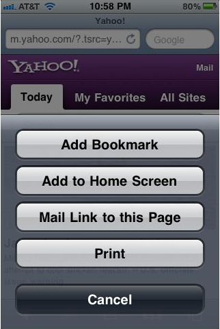
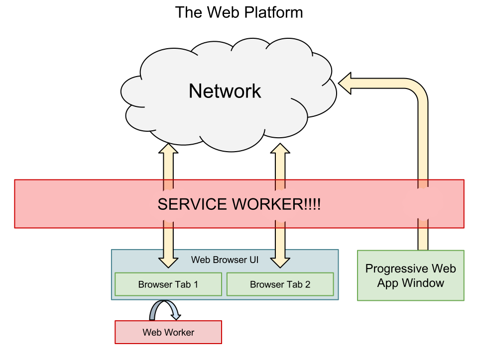

# {{page.title}}

<!-- Link to trigger conversion script -->
[Convert to Slide Deck](#aslides)

Abstract: With new web technologies enabling a new generation of install-able app-like websites it is important to ensure the web carries on working for everyone. This talk will discuss the P in PWA, progressive web apps should work for everyone and should not let their app-like approach divorce them from the web.

<!-- This slide uses information from _config.yml -->
<blockquote class="dark" style="background-image: url('images/bird1.jpg');">
<h1>{{ page.title }}</h1>
<h3>{{ page.description }}</h3>
<h2>{{site.author.name}} - {{site.author.company}}
<br />
@lady_ada_king, @samsunginternet
</h2>
</blockquote>

## A quick example install of a Web App

I am going to make the assumption that everyone who managed to get tickets to FFConf keeps their ear to the ground WRT the web.

*Quick show of hands who here thinks they have a pretty good idea what a progressive web app is?*

A progressive web app at it's heart is a website.

That website is usually designed to appear native like.

The website will take advantage of new web platform features when they are available.

These features enable native like functionality such as working offline and push notifications.

<!-- This slide uses information from _config.yml -->
<script>window.setDynamicSlide(window.playVideo);</script>
<blockquote class="dark">
<h1>A quick example of a web app:</h1>
<video src="images/add-to-homescreen.m4v" autoplay="true" muted></video>
</blockquote>

We must learn to accept that not all web platform features are available everywhere.

As much as we would love to give every user the same experience new browser features are not available everywhere yet.

That is okay.

<blockquote class="dark" style="background-image: url('images/bird2.jpg');">
<h1><i>The future is already here — it&#x27;s just not very evenly distributed.</i> - William Gibson</h1>
</blockquote>

## Web is declarative

The web is designed to be declarative.

It is designed to be interpreted depending on the platform.

*SpaceJam*

This is what allows websites written years ago work on devices which never existed at the time.

There are many other benefits to being web like which the current trend of reimplementing the browser's capabilities in JavaScript is throwing away.

<script>window.setDynamicSlide(window.elByEl());</script>
<blockquote class="dark" style="background-image: url('images/bird9.jpg');">
<h1 style="text-align: center;">Declarative VS Programmatic</h1>
<p></p>
</blockquote>

## The web is based on Standards

The web is based on agreed upon standards this both a strength and a weakness.

The weakness is that new practises and technology take a long time to reach the web.

This is because each standard is often hotly debated to ensure that is is:

* security
* privacy
* accessibility
* extensibility
* implementability
* performance

This weakness becomes it's strength in the long term:

Years down the line this usually pays off as it maintains some of the fundamental goals of the web:

<script>window.setDynamicSlide(window.elByEl());</script>

<blockquote class="dark" style="background-image: url('images/bird10.jpg');">
<h1 style="text-align: center;">The web is based on Standards</h1>
<h1><span style="color: skyblue;">Feature?</span><span style="float: right; color: pink;">Security!</span></h1>
<h1><span style="color: skyblue;">Feature?</span><span style="float: right; color: pink;">Privacy!</span></h1>
<h1><span style="color: skyblue;">Feature?</span><span style="float: right; color: pink;">Accessibility!</span></h1>
<h1><span style="color: skyblue;">Feature?</span><span style="float: right; color: pink;">Extensibility!</span></h1>
<h1><span style="color: skyblue;">Feature?</span><span style="float: right; color: pink;">Implementability!</span></h1>
<h1><span style="color: skyblue;">Feature?</span><span style="float: right; color: pink;">Performance!</span></h1>
</blockquote>

## Lovely Web Features

The goal of the web is to bring the most perf to the most people

* Ease of use - The web is designed so that sites can be made without specialised knowlege of specific platforms.

* It's designed to be fast on low performance devices.
 * Animates fast - 60FPS
 * Start fast so users can engage with your content before downloading is finished

* Can be interpreted to work anywhere
 * Desktop Computers
 * TVs
 * Phones
 * Screen Readers
 * Braille display
 * Virtual Reality
 * Terminals
* More accessible to a very wide audience
* Content is not locked to a single manufacturers product
* Content is usually available equally anywhere in the world.

* URLs Enable Sharing, this string of characters has meaning and people know what to do with it.
* They know how to share a web page because it has a url associated with it

* Security and Privacy have extremely high priority as it is a huge attack target.

* Designed to work now and in many years, we don't break the web.
* Very few APIs get deprecated. `<blink>` :tear:

* It is also extensible so if you want you can throw all that loveliness away and rebuild the web platform in JavaScript. :trashcan:

These lovely feaures only come out of lots of work and debate put in amongst standards bodies.

<script>window.setDynamicSlide(window.elByEl());</script>

> > ```html
> > <html>
> > 	<head>
> > 		<title>My first website!</title>
> > 	</head>
> > 	<body>
> > 		<h1>About Me!</h1>
> > 		<a href="https://example.com/cats.html">I love cats!!</a>
> > 		
> > 	</body>
> > </html>
> > ```
>
> > <h1 style="font-size: 120px;">⏱</h1>
> > 
>
> Device Wall
>
> <span style="font-size: 50vw; display: flex; align-content: center; justify-content: center; align-items: center; flex-grow: 1;">🌎🌍🌏</span>
>
> <span style="font-size: 120px; display: flex; align-content: center; justify-content: center; align-items: center; flex-grow: 1;">https://</span>
>
> <span style="font-size: 50vw; display: flex; align-content: center; justify-content: center; align-items: center; flex-grow: 1;">😎🔐</span>
>
> > 
> >
> > ### http://info.cern.ch/hypertext/WWW/TheProject.html
>
> <span style="font-size: 120px; display: flex; align-content: center; justify-content: center; align-items: center; flex-grow: 1;">&lt;blink&gt; 😢</span>
>
> <span style="font-size: 50vw; display: flex; align-content: center; justify-content: center; align-items: center; flex-grow: 1;">🗑</span>

## The Web Platform Responds to Trends When they Are No Longer Fashionable

The advent of smartphones hailed the beginning of a new era of the web.

The World Wide Web was available on a handheld device with incredible market penetration.

So the first thing content providers do is invent `m.` websites to cut off those devices from the desktop web.

Which wasn't ver webby at all.

Eventually we rembered that the same website could be shipped to a wide variety of devices and fit accordingly and a new era of responsive design was born.


In 2011 apple introduced a concept called safe to home screen for iOS Safari.

This simple concept launched the idea that one could make phone formatted websites

which could be indistinguishable from native apps.

In 2011 this was very difficult there were lots of browser inconsistencies.

Old and difficult apis were required for offline support.


Since then there has been a huge drive for interoperability between the browser manufacturers. Yay!!


The idea behind delivering apps via the web kinda stuck around, it's too lovely of an experience to let disapear.

New APIs were forged in the fires of mountainview and in 2014 the Service Worker was born.

<script>window.setDynamicSlide(window.elByEl());</script>

> <span style="font-size: 120px;">http://m.blah.com 😢</span>
>
> > 
> >
> > ## https://en.wikipedia.org/wiki/File:Content-is-like-water-1980.jpg
>
> > 
> >
> > ## https://xkcd.com/1367/
>
> 

This spawned a revolution in

## What about native apps?

Now i have spoken at length about the power of the web what about native

After all

Last week I was speaking at Moz Fest and we asked the audience for what they loved most about native platforms on iOS and Android

Here were their responses:

* Integrated UI
* Offline Capable
* Push Notifications
* Performant
* Sellable

Today I would like to show many of you how these native-like features are no longer tied to native platform

And are available to use to build apps in the web today.

Allowing you to have your cake and eat it too!!

## Building these features


## It's a lot of work and APIs to wrangle

Easy to throw away what makes the web Lovely

## Focus on writing HTML and CSS

<blockquote class="dark">
<h1>What about native apps?</h1>
<p></img></p>
</blockquote>


## How do PWAs change this?

Most APIs enhance the web within the context of a browser.

New APIs realted to progressive web apps use new APIs to enhance the web beyond the browser and the network.

You don't need to be building a progressive web app to take advantage of them.

One can build a website which is no longer tied to a browser window.

Using a service worker you are no longer reliant upon the network,

Once the service worker is running you can provide cached content or fabricate new content on a whim.

One could even interact with the user without even rendering a line of html via push notifications.

<script>window.setDynamicSlide(window.elByEl());</script>

> 
>
> 
>
> 
>
> 

> # Attributions
> * Mocking Bird Argument - https://commons.wikimedia.org/wiki/File:Mocking_Bird_Argument.jpg?uselang=en-gb
> * My article on progressive web apps - https://www.smashingmagazine.com/2016/09/the-building-blocks-of-progressive-web-apps/


<script>

	// Fancy Emojis
	window._addScript('https://twemoji.maxcdn.com/2/twemoji.min.js')().then(function () {
		twemoji.parse(document.body, {
			folder: 'svg',
			ext: '.svg'
		});
	});

	// Add links to deep link into slides
	var blockquote = Array.from(document.querySelectorAll('body > blockquote'));
	var newSpans = [];
	document.querySelector('a[href="#aslides"]').addEventListener('click', function () {
		newSpans.forEach(function (s) {
			s.removeEventListener('click', onclick);
			s.remove();
		});
		newSpans.splice(0);
	});
	blockquote.forEach(function (el) {
		var span = document.createElement('span');
		newSpans.push(span);
		span.textContent = ' View Slide';
		span.addEventListener('click', function onclick() {
			window.removeHashChangeEventListener();
			newSpans.forEach(function (s) {
				s.removeEventListener('click', onclick);
				s.remove();
			});
			init().then(function () {
				document.querySelector('.a-slides_slide-container').dispatchEvent(new CustomEvent('a-slides_goto-slide', {detail: {slide: el.parentNode}}));
			});
		});
		span.setAttribute('class', 'slide-view-button');
		el.appendChild(span);
	});
</script>