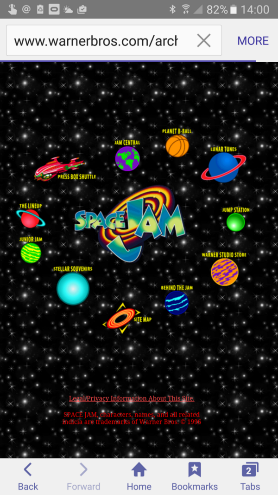
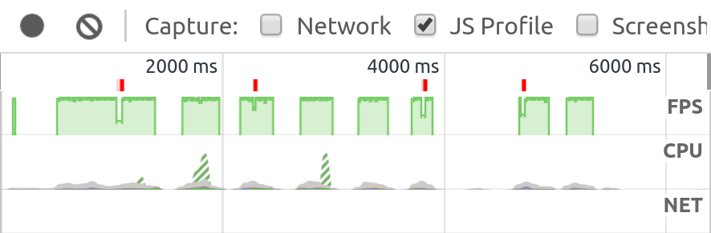
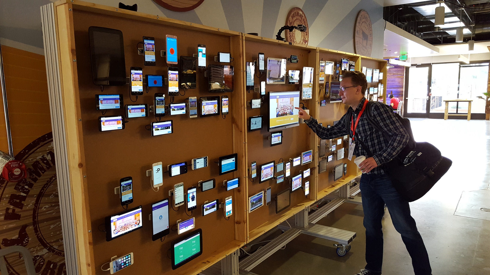
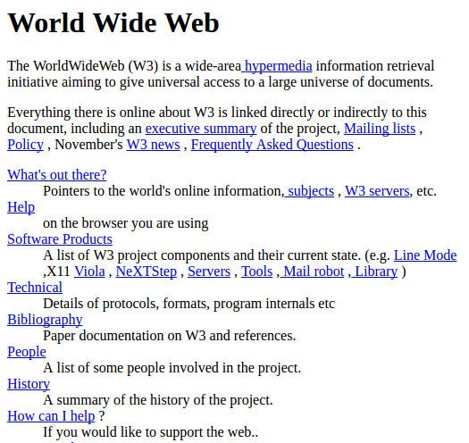
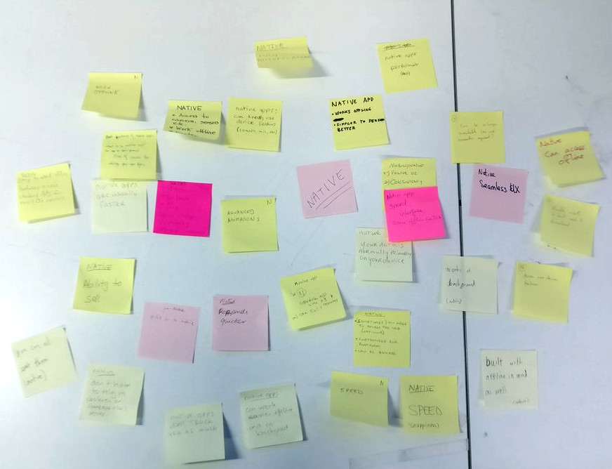

# {{page.title}}

<!-- Link to trigger conversion script -->
[Convert to Slide Deck](#aslides)

Abstract: With new web technologies enabling a new generation of install-able app-like websites it is important to ensure the web carries on working for everyone. This talk will discuss the P in PWA, progressive web apps should work for everyone and should not let their app-like approach divorce them from the web.

<span id="a-slides_clock">40</span> mins

<!-- This slide uses information from _config.yml -->
<blockquote class="dark" style="background-image: url('images/bird1.jpg');">
<h1>{{ page.title }}</h1>
<h3>{{ page.description }}</h3>
<h2>{{site.author.name}} - {{site.author.company}}
<br />
@lady_ada_king, @samsunginternet
</h2>
</blockquote>

## A quick example install of a Web Apps

*Quick show of hands who here thinks they have a pretty good idea what a progressive web app is?*

A progressive web app at it's heart is a website.

That website is usually designed to appear native like.

The website will take advantage of *NEW* web platform features when they are available.

These features enable native like functionality such as working offline and push notifications.

These features are not available everywhere.

My message for this talk is that it is okay to give different experiences to different users.

As long as your content arrives.

<!-- This slide uses information from _config.yml -->
<script>window.setDynamicSlide(window.playVideo);</script>
<blockquote class="dark">
<h1>A quick example of a web app:</h1>
<video src="images/add-to-homescreen.m4v" autoplay="true" muted></video>
</blockquote>


## Content vs Context
<script>window.setDynamicSlide(window.elByEl());</script>

Your content is the product you are trying to deliver it has extremely wide support on the web.

It usually looks like this.

The Context enhances the content to make it more accessible, engaging, interactive or aesthetically pleasing.

It usually looks like this.

The new progressive web app features add extra functionality to the web platform

This allows you to give a native-like browsing context to your content.

> 
>
> 

## The future

The web is so widely available that not every feature works on every browser.

There is a long tail of browsers which due to circumstances out of your control can not recieve everything.

Browsers are rarely in a factory state.

They are called user agents because they act on behalf of the user to interpret the web to their needs.

<script>window.setDynamicSlide(window.elByEl());</script>
<blockquote class="dark" style="background-image: url('images/bird2.jpg');">
<h1><i>The future is already here — it&#x27;s just not very evenly distributed.</i> - William Gibson</h1>
<ul style="font-size: 1.5em;">
<li>Old Browser</li>
<li>Feature reduced browser</li>
<li>Feature disabled by browser configuration</li>
<li>Asset didn't arrive over the network</li>
<li>Feature unavailable for that browsing context.</li>
</ul>
</blockquote>


## Web is declarative

The web is designed to be declarative.

This is how the web is meant to be and a fundamental difference from native.

It is designed to be interpreted depending on the platform.

This is what allows websites written years ago work on devices which never existed at the time.

*SpaceJam*

It allows the web to remixed on the front end to be individual on a per-user basis.

This is power that is taken away from you and given to the user.

If you move from a programmatic platform to an interpreted one this may feel very uncomforatble.

HTML and CSS may seem too easy but theur flexibility allows for robust sites which will work everywhere for a long time.

The web isn't cruel though it provides javascript to allow you to take control of web features to make them "better" but more prescriptive.

JavaScript allows you to send additional functionality to user agents or reimplement entire browser features but with great power comes great responsibility.

What allows all the different browsers to work together is standards.

<script>window.setDynamicSlide(window.elByEl());</script>
<blockquote class="dark" style="background-image: url('images/bird9.jpg');">
<h1 style="text-align: center;">Declarative VS Programmatic</h1>
<p></p>
</blockquote>


## The web is based on Standards

The web is based on agreed upon standards this both a strength and a weakness.

The weakness is that new practises and technology take a long time to reach the web.

This is because each standard is often hotly debated to ensure that is is:

* security
* privacy
* accessibility
* extensibility
* implementability
* performance

This weakness becomes it's strength in the long term.

Down the line this usually pays off as it maintains some of the fundamental goals of the web.

It also means once Standards have settled and had two or more implementations it is pretty safe to start using them.

By accepting you will never deliver the same content.

In the past few years concerted efforts in interoperability between the browser manufacturers has allowed sites to be behave identically across platforms

Even to the point where browser-prefixed APIs have been reimplemented across browsers to support legacy sites.

<script>window.setDynamicSlide(window.elByEl());</script>
<blockquote class="dark" style="background-image: url('images/bird10.jpg');">
<h1 style="text-align: center;">The web is based on Standards</h1>
<h1 style="font-size: 1.5em;"><span style="color: skyblue;">Feature?</span><span style="float: right; color: pink;">Security!</span></h1>
<h1 style="font-size: 1.5em;"><span style="color: skyblue;">Feature?</span><span style="float: right; color: pink;">Privacy!</span></h1>
<h1 style="font-size: 1.5em;"><span style="color: skyblue;">Feature?</span><span style="float: right; color: pink;">Accessibility!</span></h1>
<h1 style="font-size: 1.5em;"><span style="color: skyblue;">Feature?</span><span style="float: right; color: pink;">Extensibility!</span></h1>
<h1 style="font-size: 1.5em;"><span style="color: skyblue;">Feature?</span><span style="float: right; color: pink;">Implementability!</span></h1>
<h1 style="font-size: 1.5em;"><span style="color: skyblue;">Feature?</span><span style="float: right; color: pink;">Performance!</span></h1>
<h1>The Web is Built to Last</h1>
</blockquote>


## Lovely Web Features

The goal of the web is to bring the most perf to the most people

* Ease of use - The web is designed so that sites can be made without specialised knowlege of specific platforms.
* It's designed to be fast on low performance devices.
  * Animates fast - 60FPS
  * Start fast so users can engage with your content before downloading is finished
* Can be interpreted to work anywhere
  * Desktop Computers
  * TVs
  * Phones
  * Screen Readers
  * Braille display
  * Virtual Reality
  * Terminals
* More accessible to a very wide audience
* Content is not locked to a single manufacturers product
* Content is usually available equally anywhere in the world.
* URLs Enable Sharing, this string of characters has meaning and people know what to do with it.
* They know how to share a web page because it has a url associated with it
* Security and Privacy have extremely high priority as it is a huge attack target.
* Designed to work now and in many years, we don't break the web.
* Very few APIs get deprecated. `<blink>` :tear:
* It is also extensible so if you want you can throw all that loveliness away and rebuild the web platform in JavaScript. :trashcan:

These lovely feaures only come out of lots of work and debate put in amongst standards bodies.

<script>window.setDynamicSlide(window.elByEl());</script>

> > ```html
> > <html>
> > 	<head>
> > 		<title>My first website!</title>
> > 	</head>
> > 	<body>
> > 		<h1>About Me!</h1>
> > 		<a href="https://example.com/cats.html">I love cats!!</a>
> > 		
> > 	</body>
> > </html>
```
>
> > <h1 style="font-size: 120px;">⏱</h1>
> > 
>
> > 
> >
> > #### https://www.flickr.com/photos/robertnyman/23241510281
>
> <span style="font-size: 50vw; display: flex; align-content: center; justify-content: center; align-items: center; flex-grow: 1;">🌎🌍🌏</span>
>
> <span style="font-size: 120px; display: flex; align-content: center; justify-content: center; align-items: center; flex-grow: 1;">https://</span>
>
> <span style="font-size: 50vw; display: flex; align-content: center; justify-content: center; align-items: center; flex-grow: 1;">😎🔐</span>
>
> > 
> >
> > #### http://info.cern.ch/hypertext/WWW/TheProject.html
>
> <span style="font-size: 120px; display: flex; align-content: center; justify-content: center; align-items: center; flex-grow: 1;">&lt;blink&gt; 😢</span>
>
> <span style="font-size: 50vw; display: flex; align-content: center; justify-content: center; align-items: center; flex-grow: 1;">🗑</span>


## Why native like behaviour came to the web


The advent of smartphones hailed the beginning of a new era of the web.

With the whole web available via portable devices content owners started to silo users of the mobile web and the m-dot website was born.

It was born out of good intentions but is ultimately bad for the web

APIs like media queries and flex-box allowed for a single site to work well across many viewport sizes.

But by this point the damage had been done, web on mobile is still tainted by:

* Silo'd mobile only sites where not all content is available
* Modals to try to get you to download an app to view the content

The goals were to take control from the user-agent 'for the user's own good.'

And it backfired in terms of user engagement.


Out of these mobile-first website ideas came the idea of a mobile web app

Where you could build a website indistinguishable from a native app and to throw away the tainted 'webby' feeeling.

In 2011 iOS safari allowed you to add them to your homescreen and the installable web app was born.


Over the years between new Standards have been agreed upon for helping bring content out of silo'd app-stores and back to the web where it belongs.

<script>window.setDynamicSlide(window.elByEl());</script>

<blockquote class="dark" style="background-image: url('images/nest.jpg');">
<h1 id="how-web-apps-grew-out-of-the-mobile-web">How Web Apps grew out of the mobile web.</h1>

<div style="flex-direction: row;justify-content: space-around;"><span style="font-size: 80px; text-align: center; max-width: 50%;">http://m.blah.com </span><div style="display: flex; flex-direction: column;">
<h4>https://xkcd.com/1174/</h4></div></div>

<blockquote>
<p></p>

<h4 id="httpsenwikipediaorgwikifilecontent-is-like-water-1980jpg">https://en.wikipedia.org/wiki/File:Content-is-like-water-1980.jpg</h4>
</blockquote>

<blockquote>
<p></p>

<h4 id="httpsxkcdcom1367">https://xkcd.com/1367/</h4>
</blockquote>

<p></p>
<span class="slide-view-button"> View Slide</span></blockquote>

## Why was native better?
<script>window.setDynamicSlide(window.elByEl());</script>

So what are the features which needed to be in the web.

Well I asked recently at MozFest for some ideas and this is what I got:

* Integrated UI
* Offline Capable
* Push Notifications
* Performant
* A place on the home screen
* Sellable

<blockquote class="dark" style="background-image: url('images/bird7.jpg');">
<h1>Why was native better?</h1>
<p></p>
<h2>Integrated UI</h2>
<h2>Offline Capable</h2>
<h2>Push Notifications</h2>
<h2>Performant</h2>
<h2>A place on the home screen</h2>
<h2>Sellable</h2>
</blockquote>

## Building these features

<script>window.setDynamicSlide(window.elByEl());</script>

Today I would like to show many of you how these native-like features are no longer tied to native platform

And are available to use to build apps in the web today.

Allowing you to have your cake and eat it too!!

### A Place on the homescreen

### Integrated UI

### Offline Capabilities

### Push Notifications

### Performance

### Web Payment APIs

> <div style="flex-direction: row;"><div class="highlighter-rouge"><pre class="highlight"><code><span class="p">{</span><span class="w">
>   </span><span class="nt">"name"</span><span class="p">:</span><span class="w"> </span><span class="s2">"Podle"</span><span class="p">,</span><span class="w">
>   </span><span class="nt">"start_url"</span><span class="p">:</span><span class="w"> </span><span class="s2">"/v7/"</span><span class="p">,</span><span class="w">
>   </span><span class="nt">"display"</span><span class="p">:</span><span class="w"> </span><span class="s2">"standalone"</span><span class="p">,</span><span class="w">
>   </span><span class="nt">"background_color"</span><span class="p">:</span><span class="w"> </span><span class="s2">"white"</span><span class="p">,</span><span class="w">
>   </span><span class="nt">"theme_color"</span><span class="p">:</span><span class="w"> </span><span class="s2">"#4E3F30"</span><span class="p">,</span><span class="w">
>   </span><span class="nt">"icons"</span><span class="p">:</span><span class="w"> </span><span class="p">[</span><span class="w">
>     </span><span class="p">{</span><span class="w">
>       </span><span class="nt">"src"</span><span class="p">:</span><span class="w"> </span><span class="s2">"/static/icon192.png"</span><span class="p">,</span><span class="w">
>       </span><span class="nt">"sizes"</span><span class="p">:</span><span class="w"> </span><span class="s2">"192x192"</span><span class="p">,</span><span class="w">
>       </span><span class="nt">"type"</span><span class="p">:</span><span class="w"> </span><span class="s2">"image/png"</span><span class="w">
>     </span><span class="p">}</span><span class="w">
>   </span><span class="p">]</span><span class="w">
> </span><span class="p">}</span><span class="w">
> </span></code></pre>
> </div></div>
>
> 
>
> 
>
> 
>
> 

## P in PWA

As well as each of these being considered a progressive enhancement themselves.

A service worker allows the network itself to be considered an enhancement.

So that after the first load your page can be expected to work offline.

This can be a great boon as people will use your site when they know their connection is poor.

The idea is to build an ofline by default mindset in the users of the web

<blockquote class="dark" style="background-image: url('images/bird5.jpg');">
<h1>Layers of Progressive Enhancement</h1>
</blockquote>

## Not breaking performance

JavaScript has many frameworks focused on getting pages to render and update fast.

Many follow the Single Page Web App pattern.

This means that everytime a page changes the browser does not reload the page.

This is a pattern which feels very native because you can present dummy content to the user as it is loading.

In controlling transitions yourself as well as having cached network responses you can go fast.

A great pattern for this is to:

Pull down the minimal assets to get the page rendered and interactive.

Try to have the content in the HTML asset.

Then pull down any additional content assets, images and the like.

Then you can start building your single page web app around the content you have loaded in.

<script>window.setDynamicSlide(window.contentSlide([
	{markdown: '# Performance'},
	{markdown: '# True Fact: A new JavaScript Framework is released every 6 seconds*\n\n## *Not a true fact'},
	{video: 'images/dummy-content.mp4'},
	{html: [
		'<ol style="font-size: 1.5em;" class="prpl">',
		'<li>Push critical resources for the initial route.</li>',
		'<li>Render initial route.</li>',
		'<li>Pre-cache remaining routes.</li>',
		'<li>Lazy-load and create remaining routes on demand.</li>',
		'</ol>'
	].join('')}
]));</script>
<blockquote class="dark" style="background-image: url('images/bird6.jpg');">
<h1>Performance</h1>
<div>
<h1 id="true-fact-a-new-javascript-framework-is-released-every-6-seconds">True Fact: A new JavaScript Framework is released every 6 seconds*</h1>
<h3 id="not-a-true-fact">*Not a true fact</h3>
</div>
<div>
dummy-content.mp4
<video src="images/dummy-content.mp4" autoplay="true" muted></video>
</div>
<ol style="font-size: 1.5em;" class="prpl">
<li>Push critical resources for the initial route.</li>
<li>Render initial route.</li>
<li>Pre-cache remaining routes.</li>
<li>Lazy-load and create remaining routes on demand.</li>
</ol>
</blockquote>

## The cost of a progressive web app

What you gain in screen real estate and appearing native

You lose the browser context

* History Tools
* Bookmarks
* Easy Access to Copy/Edit the url (well known pattern)

Don't want to take all Native features try to avoid losing web ones.

You can provide hooks into the History api.

You can use sharing buttons or the upcoming share APIs to enable sharing when the URL bar is hidden.

> 
> 

## Conclusions

You are not building for native

Don't think like a native developer

You are building for the web, think webby, this means:

* Starts fast and displays some content whilst downloading rest.
* Doesn't break when some features are unavailable.
* Not in a SILO, if I see a DOT-PWA website I will be mad.
* Don't break accessibility, try to optimise keyboard only interaction.

Take advantage of the interpreted power in the web to break gracefully, be robust over the network and keep working long into the future.

By building websites which are meant to last we will build a web which is built to last.

<blockquote class="dark" style="background-image: url('images/bird4.jpg');">
<h1>Think Webby! Feel Native!</h1>
</blockquote>

## Attributions

> # Attributions
> * Mocking Bird Argument - https://commons.wikimedia.org/wiki/File:Mocking_Bird_Argument.jpg?uselang=en-gb
> * My article on progressive web apps - https://www.smashingmagazine.com/2016/09/the-building-blocks-of-progressive-web-apps/


<script>

	// Fancy Emojis
	window._addScript('https://twemoji.maxcdn.com/2/twemoji.min.js')().then(function () {
		twemoji.parse(document.body, {
			folder: 'svg',
			ext: '.svg'
		});
	});

	// Add links to deep link into slides
	var blockquote = Array.from(document.querySelectorAll('body.post > blockquote'));
	var newSpans = [];
	document.querySelector('a[href="#aslides"]').addEventListener('click', function () {
		newSpans.forEach(function (s) {
			s.removeEventListener('click', onclick);
			s.remove();
		});
		newSpans.splice(0);
	});
	blockquote.forEach(function (el) {
		var span = document.createElement('span');
		newSpans.push(span);
		span.textContent = ' View Slide';
		span.addEventListener('click', function onclick() {
			window.removeHashChangeEventListener();
			newSpans.forEach(function (s) {
				s.removeEventListener('click', onclick);
				s.remove();
			});
			init().then(function () {
				document.querySelector('.a-slides_slide-container').dispatchEvent(new CustomEvent('a-slides_goto-slide', {detail: {slide: el.parentNode}}));
			});
		});
		span.setAttribute('class', 'slide-view-button');
		el.appendChild(span);
	});
</script>