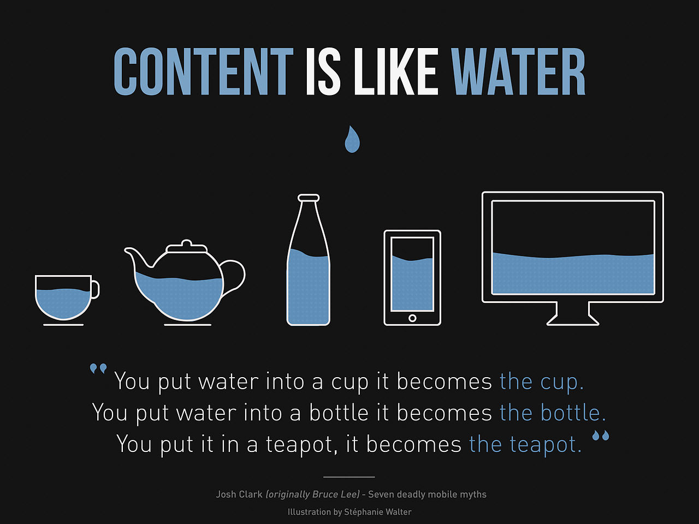
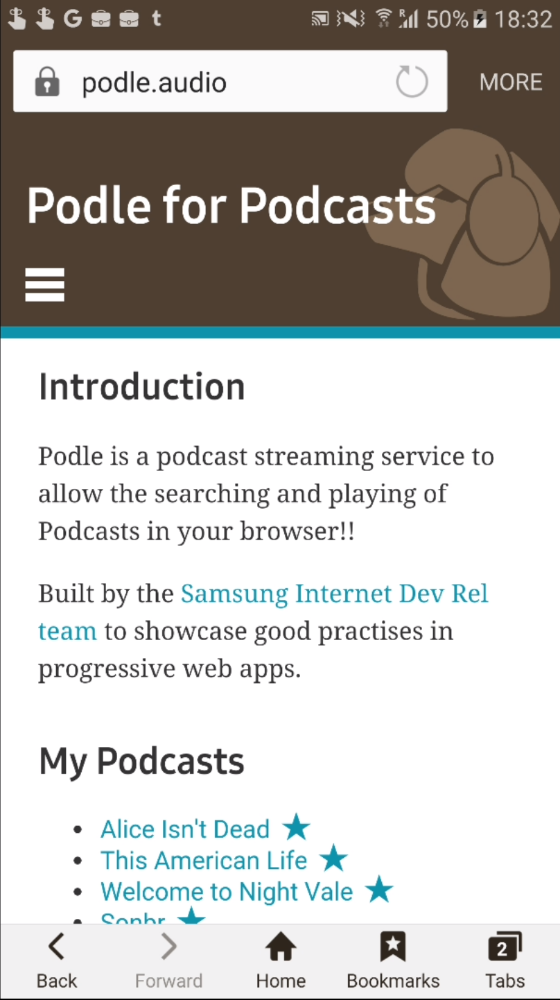
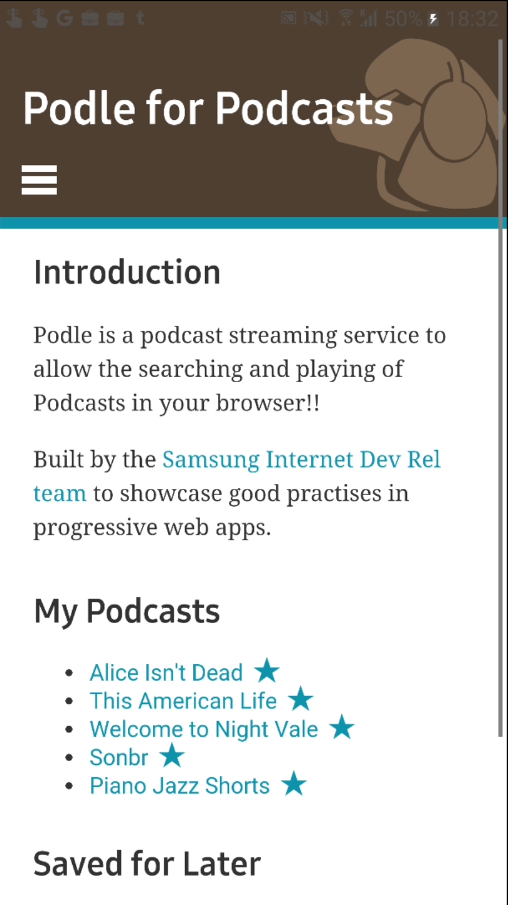

# {{page.title}}

<!-- Link to trigger conversion script -->
[Convert to Slide Deck](#aslides)

I am Ada Rose from Samsung Internet Developer Relations I am here to talk to you about Web Apps. Can I have a quick show of hands:

* Who here is a web developer?
* Who here develops native apps?

I am aiming this talk at everyone as good web app requires designs from both.

<script>window.setDynamicSlide(window.elByEl());</script>

<!-- This slide uses information from _config.yml -->
<blockquote class="dark" style="background-image: url('images/bird1.jpg');">
<div>
<h1>{{ page.title }}</h1>
<h3>{{ page.description }}</h3>
<h2>{{site.author.name}} - {{site.author.company}}
<br />
@lady_ada_king, @samsunginternet
</h2>
</div>
<div>
<h1>Samsung Internet</h1>
<p>

</p>
</div>
</blockquote>

## Role of a web app

The world of apps is like speed dating.

* Many options
* Huge variation in quality
* All want a place in your phone

The current state of apps is one where you can't experience them until you have downloaded them.

Which is akin to being asked for your hand in marriage before you have even had one date.

Customers have a pretty reasonable fear commitment so will likely be scared off.

<b>The average user installs 0 apps per month.</b>

By building a web app the user can try your website before deciding whether to keep it.

Allowing you to gain that initial interaction and will continue to engage.

<script>window.setDynamicSlide(window.elByEl());</script>

<blockquote class="dark">
<div>
<p></p>
<h3 style="font-size: 0.7em; font-weight: normal;">https://commons.wikimedia.org/wiki/File:Birds_on_the_wire_-_crop.jpg</h3>
</div>
<div>
<p>


</p>
</div>
<div>
<p></p>
<h3 style="font-size: 0.7em; font-weight: normal;">https://upload.wikimedia.org/wikipedia/commons/9/98/Nokia-300-angry-birds.jpg</h3>
</div>
<p>
</p>
</blockquote>

## What is a progressive web app?

A progressive web app is a web site which has certain <i>app-like</i> features such as:

* On the homescreen
* Can perform push notifications
* Works offline
* Has touch interactions which respond instantly

Whilst maintaining <i>web-like</i> features such as

* Cross platform
* Fast loading
* Deep linking
* On the open web

An ideal web app fulfills the role of your responsive website as well as being your presence on the user's homescreen.

The technology you choose to build it will depend on your product and your developers.

<!-- This slide uses information from _config.yml -->
<script>window.setDynamicSlide(window.playVideo);</script>
<blockquote class="dark" style="background-image: url('images/bird2.jpg');">
<h1>What is a progressive web app?</h1>
<video src="images/podle-demo.webm" autoplay="true" muted></video>
</blockquote>

## Is a progressive web app right for you?

* Do you need
* Ideal use cases: Documents, media streaming, retail (mention web payment apis), communication, low-mid end gaming, VR, need easy sharing i.e. trying to go viral.
* Small teams aiming at a wide variety of platforms with a single product, but still need a presence on the home screen. Non-profits especially due to fiscally eficient and high engagement.
* Take advantage of the web's built in security and privacy powers, increase sharing and engagement, deploy in seconds rather than hours, strong developer eco system.

<blockquote class="dark" style="background-image: url('images/bird3.jpg');">
<div>
	<h1>Is a Web App right for you?</h1>
	<h2>(It probably is)</h2>
</div>
</blockquote>

## How do web apps increase engagement?

* Users don't want a relationship with your product. By downloading an app you are trying to build a relationship. A web app is 'try before you buy', it is dating before you get into a relationship.

* Each action in installing an app will cause users to drop off. By sending user's away from your website to an app store will get only small fraction of your users engaging with your product again.

* Push notifications can be used to bring users back to your web app. In a future date.

* A place on the homescreen gives you a place in their mind.

<script>window.setDynamicSlide(window.elByEl());</script>
<blockquote class="dark" style="background-image: url('images/bird4.jpg'); font-size: 2em; font-weight: normal;">
<div><h3><i>
	“I’m not here to enter into a relationship. I just want to buy something.”
</i></h3><h4>
	 Jared M. Spool - The $300 Million Button <br /> (https://articles.uie.com/three_hund_million_button/)
</h4></div>
<div>
<h3><i>
	“Research has shown that the UX of requiring an action creates a 20% fall off rate, which has a direct effect when you want to send your users away to an app store.”
</i></h3><h4>
	 Remy Sharp - State of the gap <br /> (https://remysharp.com/2016/05/28/state-of-the-gap)
</h4></div>
</blockquote>

## When may a web app not be the best route?

* Do you need access to low level device apis not available through the web.
  * High End gaming
  * Bluetooth
* Do you need to circumvent the web's security model. (For your user's sake I hope not.)
  * The web platform tries to resist allowing APIs which could enable user tracking and privacy.

<blockquote class="dark" style="background-image: url('images/bird5.jpg');">
<h1>Web Apps can't fulfill every app use case.</h1>
</blockquote>

## What goes into a web app

The best practises for web apps are a combination of the best practises for the web and the best practises for native apps.

But there are a few buzzwords which apply to all progressive web apps

* Responsive Design - They should work on a wide variety of screen layouts from desktop to mobile.
* Offline First - They should present some content if the network fails. A blank screen or a browser error is not acceptable.
* Progressive Enhancement - All of the features I listed above are now standardised as part of the web platform but are not implemented everywhere yet. Progressive enhancement allows your website to still provide your content if certain features are not present yet.

<blockquote class="dark" style="background-image: url('images/bird8.jpg');">
<h1>Some buzzwords</h1>
<h2>Responsive Design</h2>
<h2>Offline First</h2>
<h2>Progressive Enhancement</h2>
</blockquote>


## Responsive Design

Since the advent of the mobile web this has been standard practise but I will refresh it quickly here, there are many great articles written on how to do responsive design well.s

* Mobile First
* No horizontal scrolling
* Allow zooming in for accessiblity
* must still work on the desktop

> 
> <div><small>https://en.wikipedia.org/wiki/File:Content-is-like-water-1980.jpg</small></div>

## Offline First
* local databases e.g. idb -> pouch for syncing
* service workers
* cache api, the cache api allows one to store network responses. This is very powerful api allowing here are a few examples of how it can be used.
  * Use this to provide stale content when the network is not optimal.
  * Store rarely changing resources to avoid repeat network events.
  * Speed up responses by providing cached content, then updating in the background.


<script>window.setDynamicSlide(window.playVideo);</script>
<blockquote style="background: #f8f6f8;">
<video src="images/dino.m4v" autoplay="true" muted></video>
</blockquote>

## Progressive Enhancement

Not all app-like features are supported by all browsers it is up to you to decide what is important and what is not.

* Work out minimum functionality and 'must have' features
* Decide how to support them, provide a polyfill, a fallback feature, no feature or deny that user any content.
* Long tail of the web so more work less gain.

E.g. For Podle the base functionality is searching for and playing podcasts.
This can be accomplished with just HTML forms and links. So that is my base functionality.

I provide some progressive enhancements (stats for the UK from caniuse)

None of these experiences are essential to the podcast experience but are enhancements.

* If indexeddb is supported I store their preferences (93.8% of users)
* If service workers are supported they can go offline (58.1% of users)
* If push notifications are supported they can recieve push notifications when their podcasts update (52.59% of users)
* If the audio element is supported they can play inline (96.85% of users)
* If they have flexbox support they get a nicer layout (93.21% of users)
* If the history api is supported I do single page web app behaviour (92.16% of users)

It is okay for a user on iOS Safari because although there is no service worker so no offline or push notifications they still get a great experience regardless.

As browsers get more features they will recieve a better expereince.

* Not all browsers support push notifications that is okay
* Not all browsers support service workers that is okay

<blockquote class="dark" style="background-image: url('images/bird6.jpg');">
<h1>Progressive Enhancement</h1>
<h2>Not all users can use all features.</h2>
<ul>
<li>indexedDB (93.8% of users)</li>

<li>Service Workers (58.1% of users)</li>

<li>Push Notifications (52.59% of users)</li>

<li><code>&lt;audio&gt;</code> (96.85% of users)</li>

<li>Flexbox (93.21% of users)</li>

<li>History API (92.16% of users)</li>
</ul>

<small>Stats from caniuse for the UK October 2016</small>

</blockquote>

## Interactions

Native App users have the expectation that interactions give immediate feedback and this is expected of web apps too.

The traditional web hits the network for every single page load. This can take between 100s of milliseconds and 10s of seconds.

Which is not suitable for a web app. By returning local data you can greatly speed up the time from the click to the page updating.

It is probably a good idea to avoide refreshing the whole DOM too, just switching out the changed content you can give a seamless experience.

Dummy content can be used for transitions to give a feeling of instant loading.

In the demo behind me I artificially throttled the network connection to demonstrate the dummy content.

It can be difficult to do this oneself, there are many libraries and frameworks for building single page web apps.

<script>window.setDynamicSlide(window.playVideo);</script>
<blockquote class="dark" style="background-image: url('images/bird7.jpg');">
<h1>Interactivity</h1>
<video src="images/podle-demo.webm" autoplay="true" loop muted></video>
</blockquote>

## Preserving the benefits of the Web

Most likely you will choose to hide the URL bar for *'that appy feeling'*. This means that a whole bunch of benefits inherent to the tradional web are lost and need to be reimplemented.

* URLs provide some method of deep linking and sharing for your site. Otherwise you will loose the virality of web content.
* Network conditions and load failures. Won't be as visible handle these and assist your user.
* Probably want to opem 3rd party urls in a new browser tab
* If you make a single page web app it can be easy to break deep linking ensure users can link to any content in your website.

> 
> 

## Accessible
* Take advantage of the webs accessiblity by building syntactically

<blockquote class="dark" style="background-image: url('images/nest.jpg');">
<h1>What goes into a web app?</h1>
</blockquote>

## Security

A service worker only works on http. So redirect all users to the https version.

Use HSTS to enforce this. You can submit your website to a HSTS preload list which gets compiled into Chrome so those user's can never access an unsecured version of your site.

Power of a service worker means a malicous 3rd party could inject some scripts tweak your cache so that the malicous code sticks around long after the source has been fixed.

Any unescaped html is written to the page can be executed.

Have a restrictive CSP, disallow inline scripts and 3rd party scripts except those which you trust. On browsers which support it a CSP will reduce the risk of XSS scripting but it is important to make sure all 3rd party content is escaped before rendered.

Don't use .innerHTML, use .textContent

> ```<a target="_blank" rel="noopener"></a>```
>
> * HTTPS
> * HSTS
> * CSP
>

<script>

	// Add links to deep link into slides
	var blockquote = Array.from(document.querySelectorAll('blockquote'));
	var newSpans = [];
	document.querySelector('a[href="#aslides"]').addEventListener('click', function () {
		newSpans.forEach(function (s) {
			s.removeEventListener('click', onclick);
			s.remove();
		});
		newSpans.splice(0);
	});
	blockquote.forEach(function (el) {
		var span = document.createElement('span');
		newSpans.push(span);
		span.textContent = ' View Slide';
		span.addEventListener('click', function onclick() {
			window.removeHashChangeEventListener();
			newSpans.forEach(function (s) {
				s.removeEventListener('click', onclick);
				s.remove();
			});
			init().then(function () {
				document.querySelector('.a-slides_slide-container').dispatchEvent(new CustomEvent('a-slides_goto-slide', {detail: {slide: el.parentNode}}));
			});
		});
		span.setAttribute('class', 'slide-view-button');
		el.appendChild(span);
	});
</script>